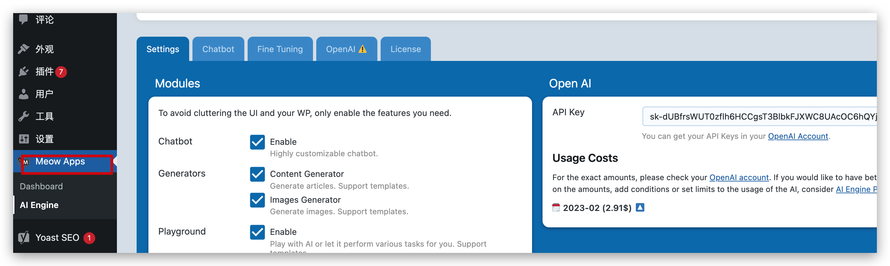

[toc]

# 说明

本文档阐述的各种玩法只是个人学习研究使用，良好的工具使用可以帮助我们更好的工作，提升工作效率。


# 零、账号准备

## Sms-active接码平台

### 申请1个账号

打开官方接码平台[https://sms-activate.org](https://sms-activate.org/?ref=4773445)，用邮箱注册一个账号，这里我用邮箱注册，激活账号并登录，此时可以看到右上角余额为0。


好了，账号注册完毕，先充值，后面用于购买国外手机号的短信验证码。

### 充值余额

接收1次OpenAI的验证码费用是大概11卢布（现在火起来后稍微贵了一些），折合人民币大约是1块钱，不过sms-active平台充值只支持美刀，且最低要求充值1美元(约等于76卢布)，谁让人家是一家独大呢。
点击右上角——充值——直接选择支付宝支付完成充值：


充值完毕，稍后刷新页面，右上角账户余额就会更新(如果没更新，多等一会儿)。

OK，暂时先不管接码平台，我们先去ChatGPT之父山姆·奥特曼创办的OpenAI公司网站申请1个账号，过程中再返回来用接码平台。

## OpenAI官方账号

### 申请1个OpenAI账号

首先打开 OpenAI https://beta.openai.com/signup 的账户注册页面。谷歌注册或者邮箱注册都可以，无所谓，我们这里用邮箱注册作为例子。由于某些原因，OpenAI官网需要使用科学网络才可以访问。


如果你已经有谷歌或者微软账号，可以直接登录，如果没有也没关系，选择邮箱注册，登录邮箱激活账号。注意这里容易遇到问题，详见文末**“问题及解决办法章节”**。

如果顺利，您将会看到如下注册页面——


这里，提供你的用户名和姓，并点击继续，OpenAI会要求你输入手机号码，注意，因为不支持国内的手机号码，所以，我们才需要上面第1步注册的接码平台，利用接码平台购买一个临时的国外手机号来接收验证码。

### 购买验证码

回到[接码平台 sms-activate.org](https://sms-activate.org/?ref=4773445)，在左侧搜索“OpenAi”，然后点击印度——点击购物车购买，注意点击了购物车就代表已经购买了。选择印度的原因是当前，截止到目前为止，印度的号码成功率最高，印尼也是可以。


复制你购买的这个印度号码，在这里，我是+91（789）2418047，你的跟我不一样。


将号码粘贴到OpenAI的注册页面输入框里，点击下方的“**发送验证码**”按钮，


在接码平台页面，点击右侧的刷新按钮，看到6位数验证码已经显示在网页上了，复制填写，完成OpenAI注册过程。如果发现过了好几分钟验证码还没有过来可能是自己的梯子网络有问题，接收不到验证码，在倒计时结束前可以在 SMS 上面取消短信接收，钱会退回到账号，然后再重新购买号码。


这里，当你看到这个页面，就可以确定你的OpenAI账号已经注册成功了。这里不用管，随便选，我们下面直接去chatgpt网站去登录就好。


### 登录ChatGPT

注册好了OpanAI账号，就可以直接登录ChatGPT了，点击[ChatGPT网站](https://chat.openai.com/auth/login) 跳转登录，尽情享受跟ChatGPT的第一亲密接触吧。这里，我尝试让ChatGPT帮我写一篇介绍如何通过sms-activate.org平台注册chatgpt账号的文章，看起来回答地还不错。


### 遇到问题及解决办法

1.注册OpenAI账号遇到“Signup is currently unavailable, please try again later” (如下图)


> 解决办法：不要用163邮箱，用微软，qq, gmail都行

1. 登录OpanAI账号遇到“Not available, OpenAI‘s service are not available in your country“不能在当前国家服务的提示(如下图)
   

> 解决办法：切换科学网络(梯子)的节点IP并刷新页面重试，根据经验，日本、韩国和欧洲的成功率高。

科学网络可以使用[忍者云](https://njregister.online/auth/register?code=vMNr)，请至少购买鸣佐套餐，节点会稳定很多。

1. 登录chatgpt网站，遇到“Access denied, You do not have access to chat.openai.com … Error reference number 1020”错误


> 解决办法：地区限制造成的，通过科学网络切换忍者云节点IP来解决，目前日本、欧洲的节点稳定。

1. 使用ChatGPT过程中，遇到了如下这些错误:
   

> 错误： “Too many requests in 1 hour. Try again later”
> ——1小时请求超次数限制了


> 错误：“An error occurred. If this issue persists please contact us through our help center at help.openai.com”
> —— 服务器不稳定

还有…

> 错误：“Too many requests. Please slow down”
> ——免费的真的不香，服务器爆了

> 错误：“An error occurred. Either the engine you requested does not exist or there was another issue processing your request. If this issue persists please contact us through our help center at help.openai.com.”
> ——服务器不稳定，未知错误

> “That model is currently overloaded with other requests. You can retry your request, or contact us through our help center at help.openai.com if the error persists. (Please include the request ID xxxxx in your message.)
> ——服务器不稳定，未知错误


# 一、微信玩法

相信大家最近被 `ChatGPT` 刷屏了，其实在差不多一个月前就火过一次，不会那会好像只在程序员的圈子里面火起来了，并没有被大众认知到，不知道最近是因为什么又火起来了，而且这次搞的人尽皆知。

想着这么火的 `AI` 完全可以好好玩一玩呀，于是就尝试着将 `ChatGPT` 接入到了个人微信中，实现在微信中调戏 `AI`。

先看几个聊天截图


还可以拉入到一个群，进行群聊，可以看到 `ChatGPT` 的训练数据相当还是比较旧的，有些问题回答的还是历史的答案。不过从上面的 `case` 可以看到，目前的这个效果比以往要好很多的，最起码可以联系上下文了，不得不说，这绝对是一个里程碑。


## 流程

想要在微信中接入 `ChatGPT` 我们需要如下几个步骤

1. 成功注册一个 `OpenAi` 的账号，获取的到一个 `API key`；
2. 基于开源项目 `wechatbot` 运行一个微信机器人程序；
3. 用微信扫码登录（建议用小号）；

### 注册

`OpenAi` 由于某些原因，在国内是无法正常注册账号的，并且连网站都是无法正常访问的，详细的注册流程不在本文的讨论范围之内，感兴趣的可以在后台回复关键字【chatgpt】查看注册细节。

这里给大家演示一下注册成功后，如何获取一个 `API key`，当我们注册成功并且登录以后，可以在链接 https://platform.openai.com/account/api-keys，在页面上点击 `Create new Secret key` 即可生成一个 `API key`，复制 `API key`存放起来，后续备用。


### 运行机器人程序

对于技术出身的朋友，程序的运行有几种方式，可以基于源码来运行，也可以基于 `docker` 来运行，这边为了简单，就直接通过 `docker` 来运行，在服务上面安装好 `docker` 后，直接运行如下命令即可。

```
docker run -itd --name wechatbot --restart=always \
 -e APIKEY=刚刚生成的 API key \
 -e AUTO_PASS=false \
 -e SESSION_TIMEOUT=60s \
 -e MODEL=text-davinci-003 \
 -e MAX_TOKENS=512 \
 -e TEMPREATURE=0.9 \
 -e REPLY_PREFIX=ChatGPT: \
 -e SESSION_CLEAR_TOKEN=下一个问题 \
 docker.mirrors.sjtug.sjtu.edu.cn/qingshui869413421/wechatbot:latest
```

正常了说启动了过后，通过 `docker ps` 命令我们可以看到有相应的 `docker` 进程如下。

' fill='%23FFFFFF'><rect x='249' y='126' width='1' height='1'></rect></g></g></svg>)

接下来我们进入的容器中，去查询二维码，并扫码登录，依次执行下面两行代码，不出意外的话，可以看到一个二维码出来，用微信扫码登录一下即可（建议用小号）。

```
docker exec -it wechatbot bash
tail -f -n 50 /app/run.log
```

扫码登录过后，我们就可以愉快的玩耍了，不过需要注意的是，`API` 的调用对于每个账户是有额度限制的，目前每个账户限制的是 18 美元，所以大家用来自己玩玩，调戏调戏 `AI` 就好，`wechatbot` 的项目地址在这里 https://github.com/qingconglaixueit/wechatbot ，感兴趣的也可以去研究研究。


## 思考

`ChatGPT` 的出现打破了以往的人工智障，虽然现在也还有很多不足的地方，相信在后面的迭代和升级中可以有更好的表现。同时 `AI` 目前已经越来越成熟，相信以后会有更多的工作岗位和技能将会被取代。

对于我们来说，唯一不变的就是变化，所以我们要做好接受新事物的准备，同时也做好应对未来的准备，尽量让自己变成不可替代的。


# 二、钉钉玩法

前面的文章给大家介绍了如何在个人微信中使用 `ChatGPT`，但是大家都知道这种操作是有风险的，所以都让大家使用小号，今天再给大家介绍一下如何在钉钉中使用机器人来调戏 `AI`。

## 流程

1. 注册钉钉开发者平台账号，并创建一个内部组织；
2. 在内部组织中创建机器人；
3. 注册 `OpenAi` 账号并获取 `Api Key`；
4. 在服务器中部署程序；
5. 在内部群中调戏 `AI`；

## 创建机器人

上面的前两步主要是为了创建一个内部组织的机器人，登录钉钉开发者后台 https://open-dev.dingtalk.com/?spm=ding_open_doc.document.0.0.7f49263crfKgSY，依次选择**应用开发 > 企业内部开发 > 机器人**，点击**创建应用**。

在这之前需要确保自己的钉钉账号已经加入了一个组织，如果没有的可以，可以自行创建一个组织。点击创建应用过后，填入相关信息


然后在开发管理菜单里面配置机器人的回调地址，也就是后面要部署代码的服务器的地址和端口，如下图所示。


这里除了直接使用服务器的 `IP` 之外，还可以配置具体的域名，不过这就需要有域名了，还可以配置 `HTTPS`，这个根据大家的情况自行使用，当时直接使用 `IP` 是最简单的一种方式。

不过配置域名的话也比较简单，就是申请一个域名，然后在配置一个 `nginx` 的反向代理，如果需要 `HPPTS` 的话再配置一个证书就好了。

接着在版本管理与发布菜单中发布机器人，此时会自动创建一个调试的群，后续可以直接在调试群里面进行调试机器人，在调试没有问题的情况就可以在其他内部群中添加该机器人了。

## 注册 OpenAi

`OpenAi` 由于某些原因，在国内是无法正常注册账号的，并且连网站都是无法正常访问的，详细的注册流程不在本文的讨论范围之内，感兴趣的可以在后台回复关键字【chatgpt】查看注册细节。

这里给大家演示一下注册成功后，如何获取一个 `API key`，当我们注册成功并且登录以后，可以在链接 https://platform.openai.com/account/api-keys，在页面上点击 `Create new Secret key` 即可生成一个 `API key`，复制 `API key`存放起来，后续备用。


## 部署服务

部署服务还是跟之前一样简单，我们还是通过 `docker` 来进行部署，一行命令就可以搞定，这里可以配置自定义的端口和上面获取到的 `API Key`，以及相应的超时时间和 `Session` 情况指令。

```
docker run -itd --name chatgpt -p 9999:9999 \
  -e APIKEY=你的 API key \
  -e SESSIONTIMEOUT=60s \
  -e MODEL=text-davinci-003 \
  -e MAX_TOKENS=512 \
  -e TEMPREATURE=0.9 \
  -e SESSION_CLEAR_TOKEN=清空会话 \
  --rm \
  docker.mirrors.sjtug.sjtu.edu.cn/eryajf/chatgpt-dingtalk:latest
```

命令执行成功过后，我们通过 `docker ps` 可以看到服务已经正常起来了，对应的钉钉开源项目地址，我也放到了后台，感兴趣的可以在公众号后台回复【chatgpt】自行获取。


服务部署成功了以后，我们可以本地测试一个端口是否能通，通过 `telnet ip port` 命令来测试，如果出现 `Escape character is '^]'.` 字符则表示是通的，如果链接不上，可能是服务器的端口没放行或者防火墙没开，可以依次检查一下。

## 调戏 AI

搭建好了机器人过后，我们就可以愉快的调戏了，这边就进行了如下的调戏，效果还是杠杠的。


最近在网上也有一些文章说这个 `AI` 通过了谷歌的面试，说是可以替代工程师，这一点倒是不太担心，至少短期还不会，虽然通过面试但并不代表能做好业务，赶超工程师的部分也只是在一些理论和八股文上面而已。

通过对 `AI` 的调戏可以发现，他每次回答问题，都会将上下文带过去一起训练的，这也是为什么他能比其他的机器人更能理解上下文的原因。

所以这种模式答案往往不是最关键的，最关键的是如何提一个好问题，并且顺着这个问题继续延伸下去。体现在日常生活中就像是两个人在进行对话一下，而不是简单的一问一答，毫无关联。

如果上下文中充斥着一些毫无关联的内容，就会给 `AI` 无形增加了很多垃圾内容，导致后续的回答可能更加毫无意义，往往看上去就显得牛头不对马嘴。

## 思考

对于如此强大的 `AI` 的出现，我们程序员要怎么避免自己被淘汰呢？让我们用魔法来打败魔法，不得不说，`AI` 给出来的建议还是很中肯的。


> 问：你如何看待 ChatGPT 的出现，是否会对程序员的行业有影响？同时作为程序员我们应该如何避免被 AI 淘汰？
>
> AI：ChatGPT 的出现可以帮助程序员更高效地开发程序，但也将给程序员带来挑战，因为许多重复的编码工作可能会被 ChatGPT 替代。
>
> 要避免被 AI 淘汰，程序员需要更加重视技术的深度，不断学习新的技术和方法，实现价值驱动的软件开发，并与 AI 合作以实现更高效的开发。
>
> 此外，程序员也可以考虑拓展自己的技能，比如学习一门新的编程语言，了解新的软件开发工具等等，以期能最大化地合理利用 AI 来提高自身的能力和竞争力。


# 三、知识星球玩法

之前给大家写过如何将 `ChatGPT` 接入微信和钉钉，没看过的可以往公众号前面的文章翻翻，最近又发现了一个有趣的玩法，周末找时间实现了一下，感觉挺不错的，分享给大家。

## 背景

事情的起因是在朋友圈看到了这样一条信息，敏感信息已经去掉了，意思很明显就是将 `OpenAI` 接入到知识星球了，用户可以通过星球提问的方式来对 `OpenAI` 进行提问，`OpenAI` 会自动回答相应用户的问题，并通知到用户。


看到这就很有意思了，对于运营了知识星球的博主来说，特别是技术类博主，很多简单的技术知识点，完全就可以通过自动化来进行回答，而不用太消耗自己的时间。

那有的小伙伴就要问了，这跟用户自己百度有什么区别呢？

只要用过 `OpenAI` 的小伙伴是深有体会的，百度搜索出来的答案广告很多不说，要在大量相似的内容中找到有用了，往往还是要花点时间的。

而 `OpenAI` 提供的答案往往思路清晰，条理分明，虽然说对于很多时效性的问题给不了确切的答案，但是对于一些技术知识点的回答还是可以很精准的。

下面是看到的一些 `case`，大家可以瞅瞅

可以写代码


会回答问题


会写大纲


会分析性能


## 搭建

上面的 `case` 看完了，那么接下来就可以开始着手搭建了，首先要知道我们该如何实现这个自动智能回答功能，思路很简单，就是先获取待回答的问题列表，然后遍历问题请求 `OpenAI` 的接口，然后再将返回的结果回写通知对应的用户，这个过程我们需要通过定时任务轮询去处理。

综上所述，我们需要准备下面这些东西

1. 一个可以被提问的知识星球账号，也就是被提问者；

2. `OpenAI` 账号对应的 `API KEY`，这一步相对会稍微麻烦一点，不过之前的文章都提供过思路如何获取，不在本文讨论的范围，感兴趣的翻翻前面的文章。

3. 调度工具或者调度平台，也可以是 `Linux` 系统的定时命令；

4. 

   实现 `API` 请求的程序或者脚本；

   

## 编程

上面的四点都是必须的，但是最主要的当然还是编写代码，按照我们上面的思路，我们这个程序需要调用三个接口

1. 获取问题列表；
2. 请求 `OpenAI` 获取答案；
3. 回写答案通知用户；

下面我们依次来看看这三个接口要如何对接，提前说明下，这边为了简单用的调度平台是 `XXL-JOB` 对应的执行任务脚本是采用 `Nodejs` 写的。

用准备好的被提问者账号登录网页版的知识星球进入到对应的星球后，可以看到有一个【等我回答】的菜单。


我们打开浏览器的控制台，点击【等我回答】按钮，就可以看到请求的对应接口地址


这是我们第一个要请求的接口地址，请把它记下来，再通过 `request header` 拿到对应的 `cookie` 信息和一些参数过后，这样我们就可以通过代码来进行接口请求了，获取到需要回答的问题列表。

```
var options = {
    url: ZSXQ_UNANSWER_URL,
    headers: {
        'accept': 'application/json, text/plain, */*',
        'cookie': cookie,
        'User-Agent': 'Mozilla/5.0 xxxx',
        'x-timestamp': Math.floor(Date.now() / 1000),
    }
};

request(options, callback);
```

获取到了问题列表过后，我们在 `callback` 回调方法里面就可以开始遍历请求 `OpenAI` 接口获取答案了，`OpenAI` 的接口地址是这个 `https://api.openai.com/v1/completions`。

```
function callback(error, response, body) {
    if (!error && response.statusCode === 200) {
        let json = JSON.parse(body);
        if (!json.succeeded) {
            console.log("succeeded false")
            process.exit(0)
        }
        if (json.resp_data.topics.length > 0) {
            let length = json.resp_data.topics.length;
            for (let i = 0; i < length; i++) {
                let question = json.resp_data.topics[i].question;
                topicId = json.resp_data.topics[i].topic_id;
                console.log(topicId + ":" + question.text)
                let openRequestOption = {
                    url: OPEN_AI_URL,
                    headers: {
                        "Content-Type": "application/json",
                        "Authorization": "Bearer " + API_KEY,
                        "topicId": topicId
                    },
                    timeout: 120000,
                    body: {
                        "model": "text-davinci-003",
                        "prompt": question.text,
                        "max_tokens": 2000,
                        "temperature": 0.9
                    },
                    json: true
                };
                request.post(openRequestOption, completionsCallBack)
            }
        } else {
            console.log("topics empty")
            process.exit(0)
        }
    } else {
        console.log("get questions error")
        process.exit(-1)
    }
}
```

将获取到的答案回写到用户，这里我们需要第三个地址了，可以跟第一个地址一样进行获取，在页面进行一个回答，就可以获取到对应的回答地址，不过需要我们自行替换其中的主题 ID，这个比较简单就不截图了，直接上代码。

```
// 智能回答
function completionsCallBack(error, response, body) {
    if (!error && response.statusCode === 200) {
        if (null != body && body.choices.length > 0) {
            let reply = body.choices[0].text;
            console.log(response.request.headers.topicId + ":" + reply);
            if (null != reply && reply.length > 0) {
                // 回答问题并通知提问者
                let answerOptions = {
                    url: ZSXQ_ANSWER_URL + "/" + response.request.headers.topicId + "/answer",
                    headers: {
                        'accept': 'application/json, text/plain, */*',
                        'cookie': cookie,
                        'User-Agent': 'Mozilla/5.0 xxx',
                        'x-timestamp': Math.floor(Date.now() / 1000),
                    },
                    timeout: 12000,
                    body: {
                        "req_data": {
                            "image_ids": [],
                            "silenced": silenced,
                            "text": reply
                        }
                    },
                    json: true
                }
                request.post(answerOptions, answerCallBack)
            }
        }
    } else {
        console.log("get answer error")
        process.exit(-1)
    }
}

// 回答后调用
function answerCallBack(error, response, body) {
    if (response.statusCode === 200 && body.succeeded) {
        console.log(":智能回答成功");
        //process.exit(0) 
    } else {
        console.log(":智能回答失败");
        //process.exit(-1)
    }
}
```

至此相应的功能基本上已经算实现了，有几个细节简单说明下

1. 回写答案接口参数中 `silenced` 代表是否通知其他人，`true` 代表只通知提问者，`false` 表示通知所有人，通知所有人就表示所有人都能看到回答，否则就只有提问者才会看到回答，刚开始调试的时候可以设置成 `true`，后期上线可以设置成 `false`。
2. 因为这个功能是需要通过定时任务来触发的，为了避免不必要的麻烦，可以自行设定合理的定时时间，比如半夜就别调用了，晚点回答别人问题并不会有什么影响，调度频次也不要太频繁，低调使用。
3. 完整的代码我已经放在后台了，回复关键字【zsxq】获取。

## 效果

在 `XXL-JOB` 上面配置一个 `NodeJs` 的任务，


可以看到这边指定了相应时间才进行查询，能看到可以智能回答成功了，对应在知识星球中也能正常的显示。爽歪歪~

## 总结

今天又给大家带来了一种 `OpenAI` 的玩法，提供了几种玩法都是自己学习研究的玩法，大家自己玩玩就好，目的是为了让大家在遇到新事物和技术的时候能保持着热情，新技术的到来我们不能保守，而是要迎接。

**最后说一点更重要的，由于公众号的改版，大家一定要把我们 【Java 极客技术】标记星标，不然容易在茫茫人海中走失呦！**


# 四、WordPress 网站玩法

对于一些站长来说，如果是通过 WordPress 搭建网站的，如果要使用 OpenAI 那是很方便，有一个官方插件可以直接安装使用，不过这同样要求我们要有自己的 OpenAI 的 API KEY。

不过需要注意下，因为现在国内的 IP 已经访问不了 OpenAI 的接口了，所以部署的网站需要在国外的站点才行~~

## 插件安装

在插件里面搜索 AI Engine，然后直接安装就可以了，


## 插件配置

安装好插件过后，我们在菜单里面会看到下面这个菜单，



在设置页面，我们需要配置上自己的 OpenAI 的 API Key，以及配置需要开启的一些功能，接下来在 ChatBot 页面，我们就可以定制化自己的 Chat 机器人了，这块可以使用默认，熟悉了之后可以设置成自己喜欢的样式。


可以配置需要的模型，以及设置相应的 Max Tokens。这里有一项配置是“Inject Default Chatbot in Entire Website”，如果启用了就可以在全站激活 Chatbot，效果就是在网站所有页面的右下角会有一个图标，我们随便打开一个页面，就可以看到这个图标，点击这个图标就可以弹出智能聊天窗口，图标的样式也可以在上面的 Chatbot 菜单的右侧进行设置。


当然如果不想在全站的页面上都有这个图标，我们可以将 “Inject Default Chatbot in Entire Website” 这个功能取消点，通过在对应页面或者文章内容的地方加上上面配置的结果信息也是可以的。

```
[mwai_chat ai_name="小猿: " user_name="你: " start_sentence="有什么可以帮助你的吗？" text_send="发送" text_input_placeholder="请跟我聊一点有意义的话题..." window="true" fullscreen="true" temperature="0.9"]
```

最后在页面上的效果就是这样


# 附录

如果只是想简单试用一下 OpenAI 的话，可以考虑国内代理的一些站点，不过这些站点可能不稳定，随时不可用~

http://www.zizhu8.top/chatgpt/index.html

https://yuandifly.com/chatgpt


